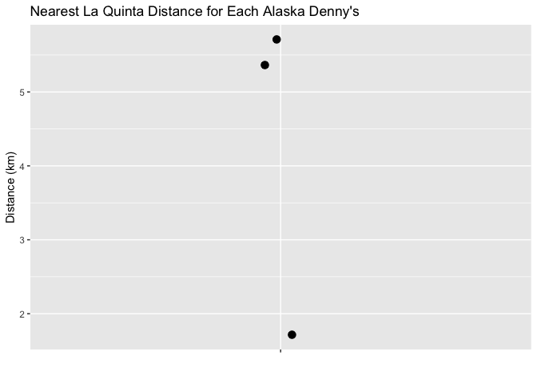
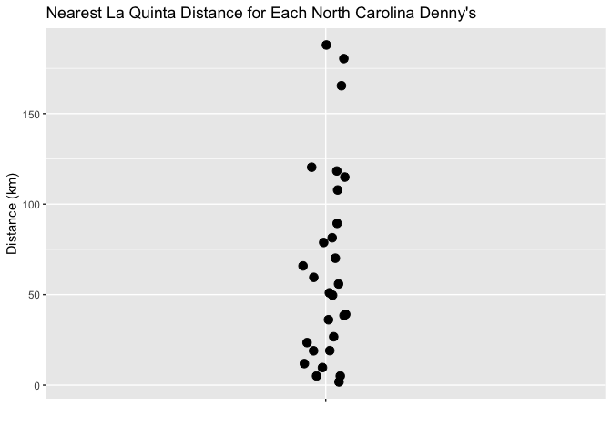
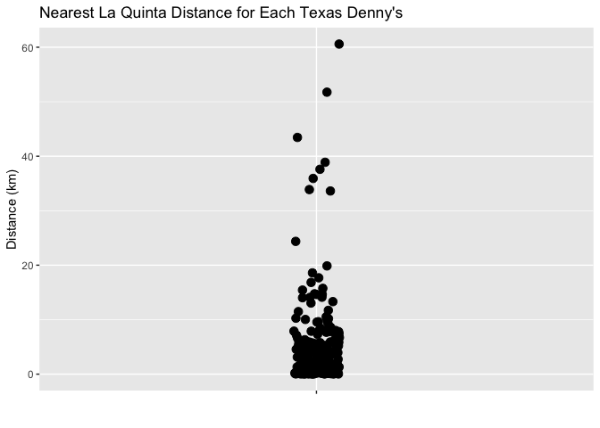
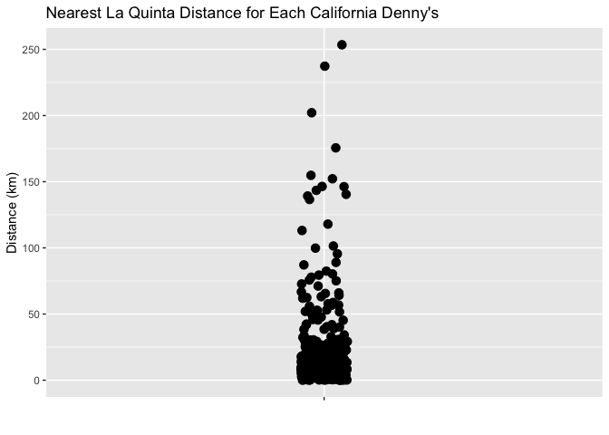

Lab 05 - La Quinta is Spanish for next to Denny’s, Pt. 2
================
Cynthia Deng
2/18/2026

### Load packages and data

``` r
library(tidyverse) 
library(readr) 
```

``` r
states <- read_csv("data/states.csv")
dennys <- read_csv("data/dennys.csv")
laquinta <- read_csv("data/laquinta.csv")
```

### Exercise 1

``` r
dn_ak <- dennys %>%
  filter(state == "AK")
nrow(dn_ak)
```

    ## [1] 3

``` r
lq_ak <- laquinta %>%
  filter(state == "AK")
nrow(lq_ak)
```

    ## [1] 2

There are 3 Denny’s and 2 La Quinta in Alaska. \### Exercise 2

``` r
nrow(dn_ak) * nrow(lq_ak)
```

    ## [1] 6

There are 6 pairs that we can calculate the distance for \### Exercise 3

``` r
dn_lq_ak <- full_join(dn_ak, lq_ak,
  by = "state"
)
```

    ## Warning in full_join(dn_ak, lq_ak, by = "state"): Detected an unexpected many-to-many relationship between `x` and `y`.
    ## ℹ Row 1 of `x` matches multiple rows in `y`.
    ## ℹ Row 1 of `y` matches multiple rows in `x`.
    ## ℹ If a many-to-many relationship is expected, set `relationship =
    ##   "many-to-many"` to silence this warning.

### Exercise 4

``` r
nrow(dn_lq_ak)
```

    ## [1] 6

The combined data frame has 6 observations.

### Exercise 5

``` r
haversine <- function(long1, lat1, long2, lat2, round = 3) {
  # convert to radians
  long1 <- long1 * pi / 180
  lat1 <- lat1 * pi / 180
  long2 <- long2 * pi / 180
  lat2 <- lat2 * pi / 180

  R <- 6371 # Earth mean radius in km

  a <- sin((lat2 - lat1) / 2)^2 + cos(lat1) * cos(lat2) * sin((long2 - long1) / 2)^2
  d <- R * 2 * asin(sqrt(a))

  return(round(d, round)) # distance in km
}
```

### Exercise 6

``` r
dn_lq_ak <- dn_lq_ak %>%
  mutate(distance = haversine(
    longitude.x, latitude.x, 
    longitude.y, latitude.y))
```

### Ecercise 7

``` r
dn_min_dist_ak <- dn_lq_ak %>%
  group_by(address.x) %>%
  summarize(min_distance = min(distance), .groups = "drop")

dn_min_dist_ak
```

    ## # A tibble: 3 × 2
    ##   address.x        min_distance
    ##   <chr>                   <dbl>
    ## 1 1929 Airport Way         5.20
    ## 2 2900 Denali              2.04
    ## 3 3850 Debarr Road         6.00

\###Exercise 8

``` r
ggplot(dn_min_dist_ak, aes(x = "", y = min_distance)) +
  geom_jitter(width = 0.05, size = 3) +
  labs(
    title = "Nearest La Quinta Distance for Each Alaska Denny's",
    x = "",
    y = "Distance (km)"
  )
```

<!-- -->

The distances between each Denny’s and its nearest La Quinta in Alaska
range from approximately 1.8 km to 6.1 km.

### Exercise 9

``` r
dn_nc <- dennys %>% filter(state == "NC")
lq_nc <- laquinta %>% filter(state == "NC")
dn_lq_nc <- full_join(dn_nc, lq_nc, by = "state")
```

    ## Warning in full_join(dn_nc, lq_nc, by = "state"): Detected an unexpected many-to-many relationship between `x` and `y`.
    ## ℹ Row 1 of `x` matches multiple rows in `y`.
    ## ℹ Row 1 of `y` matches multiple rows in `x`.
    ## ℹ If a many-to-many relationship is expected, set `relationship =
    ##   "many-to-many"` to silence this warning.

``` r
dn_lq_nc <- dn_lq_nc %>%
  mutate(distance = haversine(
    longitude.x, latitude.x, 
    longitude.y, latitude.y))

dn_min_dist_nc <- dn_lq_nc %>%
  group_by(address.x) %>%
  summarize(min_distance = min(distance), .groups = "drop")

dn_min_dist_nc
```

    ## # A tibble: 28 × 2
    ##    address.x                 min_distance
    ##    <chr>                            <dbl>
    ##  1 1 Regent Park Boulevard          108. 
    ##  2 101 Wintergreen Dr               120. 
    ##  3 103 Sedgehill Dr                  26.7
    ##  4 1043 Jimmie Kerr Road             36.1
    ##  5 1201 S College Road              188. 
    ##  6 1209 Burkemount Avenue            39.1
    ##  7 1493 Us Hwy 74-A Bypass           70.1
    ##  8 1524 Dabney Dr                    59.5
    ##  9 1550 Four Seasons                115. 
    ## 10 1800 Princeton-Kenly Road         55.9
    ## # ℹ 18 more rows

``` r
ggplot(dn_min_dist_nc, aes(x = "", y = min_distance)) +
  geom_jitter(width = 0.05, size = 3) +
  labs(
    title = "Nearest La Quinta Distance for Each North Carolina Denny's",
    x = "",
    y = "Distance (km)"
  )
```

<!-- -->

### Exercise 10

``` r
dn_tx <- dennys %>% filter(state == "TX")
lq_tx <- laquinta %>% filter(state == "TX")
dn_lq_tx <- full_join(dn_tx, lq_tx, by = "state")
```

    ## Warning in full_join(dn_tx, lq_tx, by = "state"): Detected an unexpected many-to-many relationship between `x` and `y`.
    ## ℹ Row 1 of `x` matches multiple rows in `y`.
    ## ℹ Row 1 of `y` matches multiple rows in `x`.
    ## ℹ If a many-to-many relationship is expected, set `relationship =
    ##   "many-to-many"` to silence this warning.

``` r
dn_lq_tx <- dn_lq_tx %>%
  mutate(distance = haversine(
    longitude.x, latitude.x, 
    longitude.y, latitude.y))

dn_min_dist_tx <- dn_lq_tx %>%
  group_by(address.x) %>%
  summarize(min_distance = min(distance), .groups = "drop")

dn_min_dist_tx
```

    ## # A tibble: 200 × 2
    ##    address.x             min_distance
    ##    <chr>                        <dbl>
    ##  1 100 Cottonwood              33.6  
    ##  2 100 E Pinehurst              1.39 
    ##  3 100 Us Highway 79 S         33.9  
    ##  4 101 N Fm 707                10.3  
    ##  5 1011 Beltway Parkway        14.0  
    ##  6 1015 Spur 350 West           1.74 
    ##  7 1015 West Main St            1.10 
    ##  8 10367 Highway 59            37.6  
    ##  9 10433 N Central Expwy        0.618
    ## 10 105 W 42nd St                6.88 
    ## # ℹ 190 more rows

``` r
ggplot(dn_min_dist_tx, aes(x = "", y = min_distance)) +
  geom_jitter(width = 0.05, size = 3) +
  labs(
    title = "Nearest La Quinta Distance for Each Texas Denny's",
    x = "",
    y = "Distance (km)"
  )
```

<!-- -->

### Exerse 11

``` r
dn_ca <- dennys %>% filter(state == "CA")
lq_ca <- laquinta %>% filter(state == "CA")
dn_lq_ca <- full_join(dn_ca, lq_ca, by = "state")
```

    ## Warning in full_join(dn_ca, lq_ca, by = "state"): Detected an unexpected many-to-many relationship between `x` and `y`.
    ## ℹ Row 1 of `x` matches multiple rows in `y`.
    ## ℹ Row 1 of `y` matches multiple rows in `x`.
    ## ℹ If a many-to-many relationship is expected, set `relationship =
    ##   "many-to-many"` to silence this warning.

``` r
dn_lq_ca <- dn_lq_ca %>%
  mutate(distance = haversine(
    longitude.x, latitude.x, 
    longitude.y, latitude.y))

dn_min_dist_ca <- dn_lq_ca %>%
  group_by(address.x) %>%
  summarize(min_distance = min(distance), .groups = "drop")

dn_min_dist_ca
```

    ## # A tibble: 403 × 2
    ##    address.x            min_distance
    ##    <chr>                       <dbl>
    ##  1 #2 Serra Monte              6.24 
    ##  2 10 Airport Blvd             0.093
    ##  3 1000 Imola Ave             14.5  
    ##  4 1000 W Steele Lane         58.7  
    ##  5 1001 E Capitol             13.5  
    ##  6 1010 W Alameda Ave         24.8  
    ##  7 1011 Riley Street          11.4  
    ##  8 1014 N Main St            137.   
    ##  9 1015 Blossom Hill Rd       15.4  
    ## 10 1019 East Main St          80.3  
    ## # ℹ 393 more rows

``` r
ggplot(dn_min_dist_ca, aes(x = "", y = min_distance)) +
  geom_jitter(width = 0.05, size = 3) +
  labs(
    title = "Nearest La Quinta Distance for Each California Denny's",
    x = "",
    y = "Distance (km)"
  )
```

<!-- --> \###
Exercise 12

``` r
dn_min_dist_ak <- dn_min_dist_ak %>%
  mutate(state = "AK")

dn_min_dist_tx <- dn_min_dist_tx %>%
  mutate(state = "TX")

dn_min_dist_ca <- dn_min_dist_ca %>%
  mutate(state = "CA")

dn_min_all <- bind_rows(
  dn_min_dist_ak,
  dn_min_dist_tx,
  dn_min_dist_ca
)

dn_min_all %>%
  group_by(state) %>%
  summarize(
    mean_distance   = mean(min_distance),
    median_distance = median(min_distance),
    min_distance    = min(min_distance),
    max_distance    = max(min_distance),
    .groups = "drop"
  )
```

    ## # A tibble: 3 × 5
    ##   state mean_distance median_distance min_distance max_distance
    ##   <chr>         <dbl>           <dbl>        <dbl>        <dbl>
    ## 1 AK             4.41            5.20        2.04         2.04 
    ## 2 CA            22.1            11.9         0.016        0.016
    ## 3 TX             5.79            3.37        0.016        0.016

Mitch Hedberg’s joke is most likely to hold true in Texas. Texas has the
smallest typical nearest distance between a Denny’s and the nearest La
Quinta, based on the median distance (about 3.37 km). Alaska’s median is
larger (about 5.20 km). California is least consistent with the joke
because its distances are much larger overall, especially the mean
(about 22.08 km) and median (about 11.90 km)
